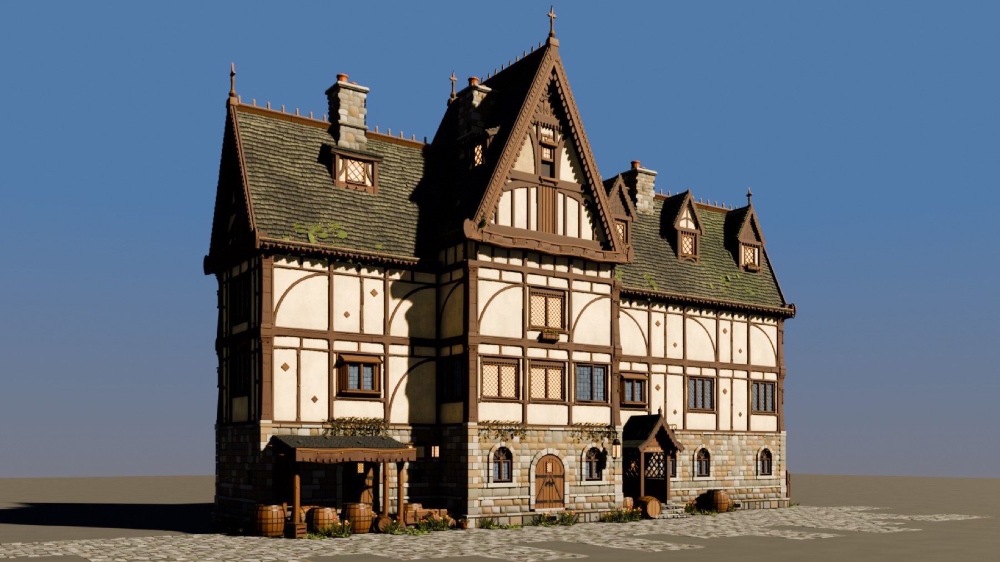
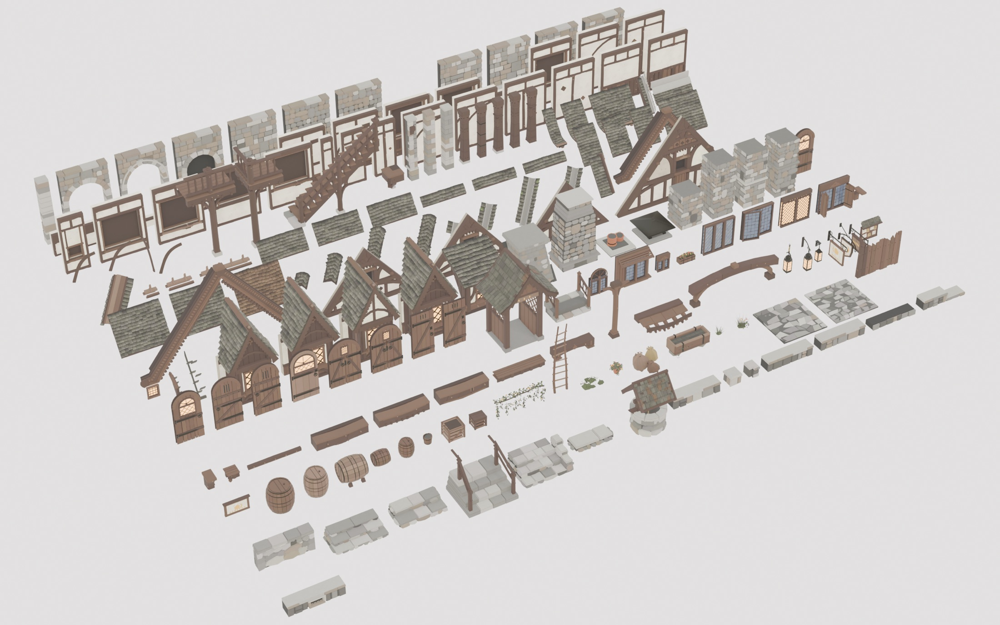
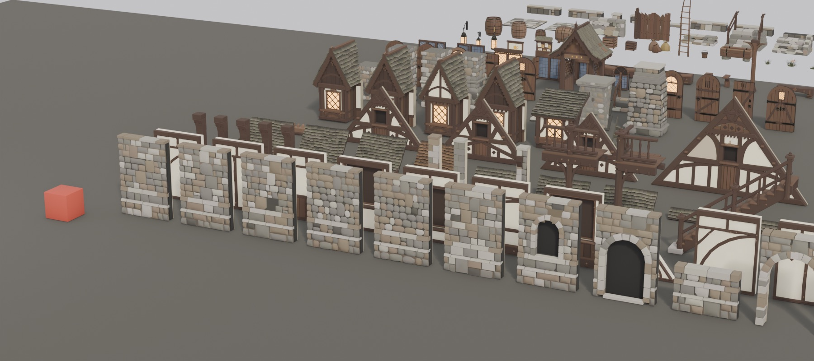
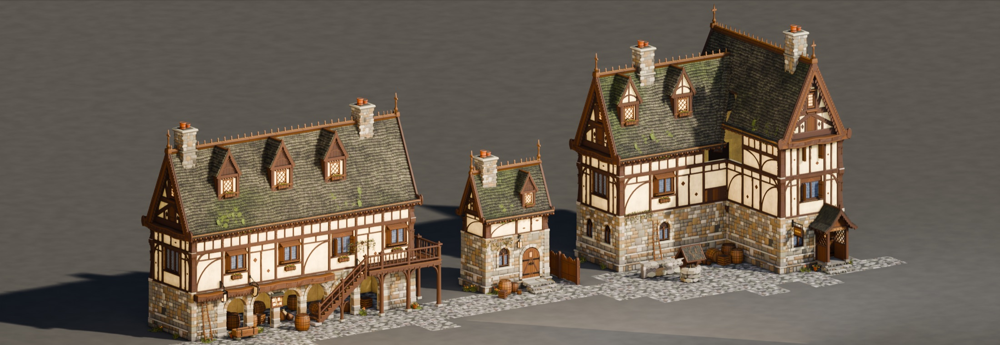
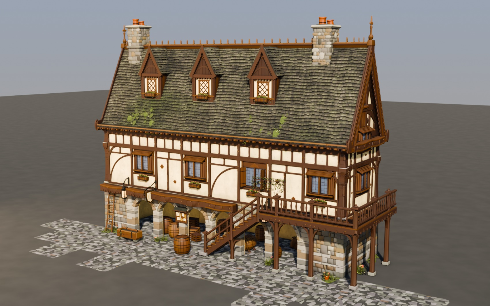
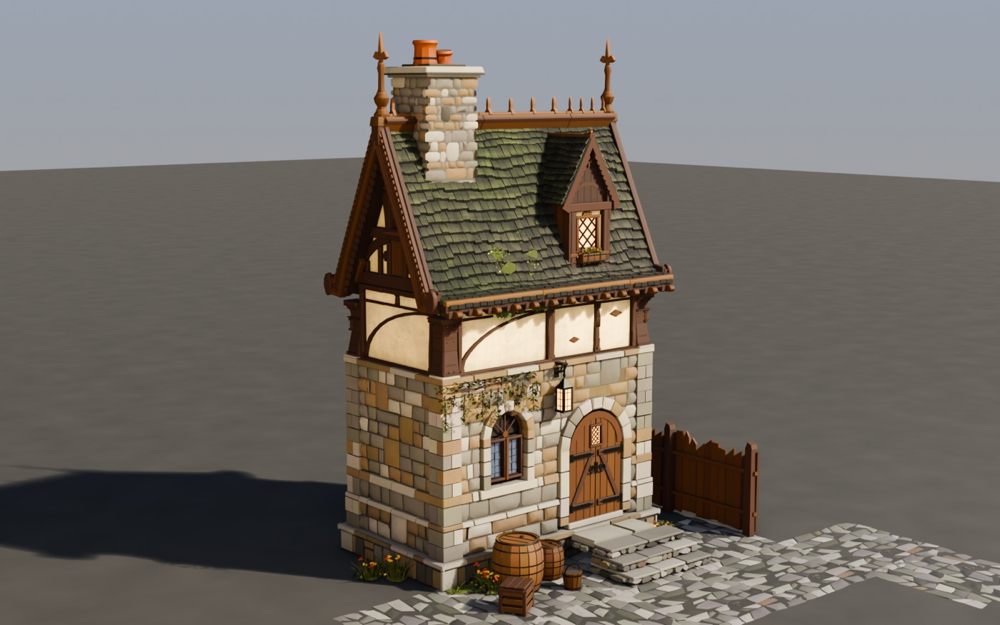
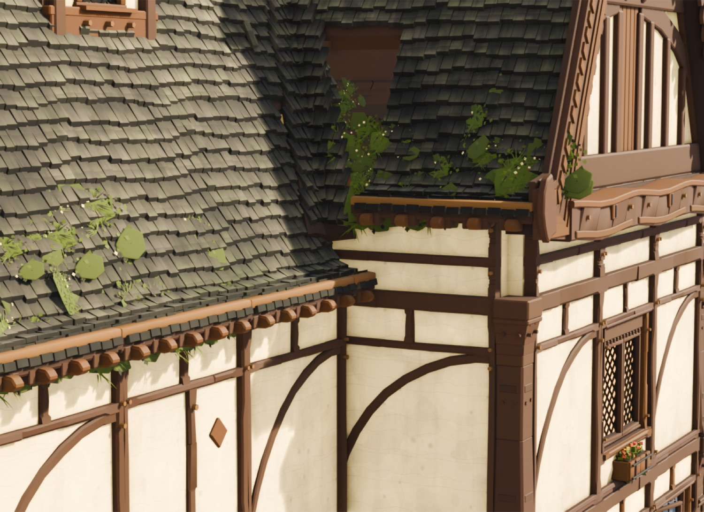
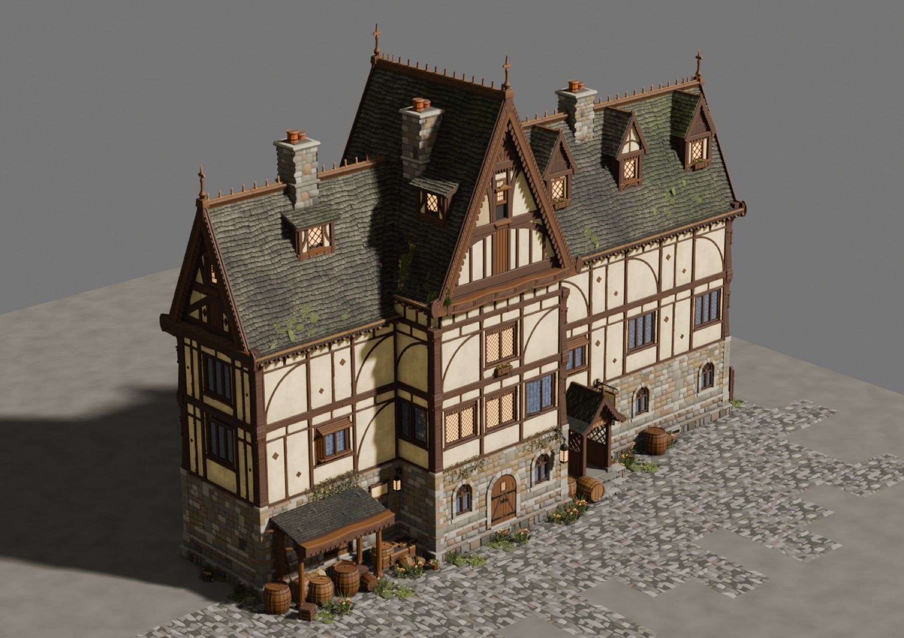

# Medieval Architecture Kit

A **modular half-timber building kit**, generated procedurally in Blender. Every piece is a
Python function on a shared 2 m grid, so the parts snap together into different buildings
rather than making one fixed model.

**182 pieces · 14 families · 277k triangles · 4 example buildings**



---

## What's in it

Every piece in the kit. 1 Blender unit = 1 metre, one bay = 2 m:



The red cube is 1 m:



## The same parts make different buildings



A market row with an arcade and a gallery, a cottage, and an L-plan with a cross wing —
all from the pieces above, no new geometry:

| | |
|---|---|
|  |  |

## Detail that survives a close-up





---

## Open it

```
models/inn_kit.blend       the library -- all 182 pieces, browsable, laid out by family
models/inn_kit.glb         the same, portable (Unity, Unreal, Godot, three.js, Maya)
models/inn_example.blend   the inn, assembled
models/inn_example.glb     the same, portable
models/layouts.blend       market row + cottage + L-plan
models/manifest.json       every piece with its family and triangle count
```

Each piece's **mesh** carries the canonical kit origin, so zeroing an object's location
snaps it to its convention position. That is how you assemble with them.

## Build it yourself

Needs Blender 4.x or 5.x. Nothing else — no addons, no dependencies.

```bash
blender -b --python build_kit.py                    # the whole kit -> out/inn_kit.blend + .glb
blender -b --python assemble_inn.py                 # the showpiece inn
blender -b --python assemble_layouts.py             # the other three buildings
blender -b --python build_piece.py -- roofs         # one family, with its own renders
blender -b --python kit_grid.py                     # the whole-kit image above
blender -b --python kit_sheet.py                    # per-family comparison sheets
```

The first three are self-contained — each builds the pieces it needs. `kit_grid.py` and
`kit_sheet.py` read `out/inn_kit.blend`, so run `build_kit.py` before them.

Builds land in `out/` and renders in `renders/`, both gitignored. `models/` holds the
prebuilt output so you don't have to run anything.

---

## How it fits together

Four conventions do all the work. They live in `kit/spec.py` and every piece obeys them.

**A wall** has its origin at the bay centre, `x ∈ [−1, +1]`, its outer face on `y = 0` with
the body toward `+y`. Two copies side by side tile with no seam.

**A corner** fills the `T × T` void *between* two wall runs. This is why any offset that is
not a whole multiple of the grid breaks a corner — it moves the corner piece out of the void
it exists to fill.

**One roof pitch, kit-wide.** Every roof piece is authored at 52° so any piece meets any
other. The assembler then presents the roof at 65° by stretching the whole roof world in Z
by `ZK = tan(65)/tan(52) = 1.675`, placing each piece at `z·ZK` with scale `(s, s, s·ZK)`.
A plane through a point scaled that way is unchanged, so every seam still meets — and one
constant changes the building's apparent pitch without re-authoring a single piece.

**Fractions are authored, not scaled.** A stretched moulding is a defect even when nothing
intersects, so the kit ships real part-pieces:

```
walls    2 m / 1 m / 0.5 m wide
         2.60 / 3.00 / 1.30 / 1.00 / 0.85 / 0.40 m tall
roof     panels of 13 / 7 / 3 shingle courses  (13 is odd, so a "half" cannot be
         half -- 7 + 3 + 3 = 13 exactly, and any remainder composes with no residue)
         eaves, ridges and valleys at 2 m / 1 m / 0.5 m
corners  the T x T void piece, inner and outer
```

**Openings are a contract.** `spec.py` declares each opening's width, height, sill and head;
walls cut them and inserts fill them, so any casement drops into any window bay unchanged.

---

## Checks

Every piece validates its own seams, bounds and triangle budget on build — a non-empty
report is a failure. On top of that:

```bash
blender -b --python check_holes.py      -- out/inn_example.blend   # see-through holes
blender -b --python check_layouts.py    -- out/layouts.blend       # through-roof + run gaps
blender -b --python check_collisions.py -- out/inn_example.blend   # interpenetration
ZFIGHT_TOL=0.0005 blender -b --python check_zfight.py -- roofs     # coincident surfaces
```

`check_holes.py` casts from *inside* the building outward: a ray that escapes is a hole you
could see through. It found one that twelve other checks and a dozen renders had missed.

Current state of the four buildings:

```
inn          731 pieces placed, 0 missing
layouts      856 pieces placed, 0 missing
holes        0 escaping rays on the layouts; 24 diffuse (0.33%) on the inn
eave laps    12 pairs, all at 0.0000 m -- seam contact, no interpenetration
```

---

## Known issues

Measured, not guessed. These are open:

- **The L-plan's inner corner, upper storey.** The stone storey closes the armpit with two
  part bays and an inner corner piece; the timber storey above it places none of the three,
  so at that one corner you see the back face of a wall panel (`M_plaster_dim`). Visible in
  the L-plan render. The stone storey below it is correct.
- **`inn_example.glb` loses UVs on 350 of 747 primitives (46.9%).** Blender's glTF exporter
  prunes a UV layer no material references. `inn_kit.glb` is clean — 696 primitives, every
  one with UVs *and* vertex colours — so **use the kit glb for engine work**; the example
  glb is for looking at.
- **36 part-panels at the ridge carry a 0.667 vertical scale.** The last 1–2 shingle courses
  of a slope, compressed on a 3-course panel that the ridge cap laps. Deliberate: the
  alternative was a 0.179 m open slot along the whole ridge.
- **No 3.00 m twin of the half-width wall**, so 4 gable fillers still carry a 1.154 height
  stretch.
- Bargeboards on a cross-wing gable legitimately rise above the roof they cross;
  `check_layouts.py` annotates those rows rather than filtering them.

---

## How this was built

Procedurally, by a loop of builder / auditor / blind-critic agents that had to prove each
fix with a measurement rather than assert it. The reusable version of that apparatus — the
validators, the fault taxonomy and the loop — is a Claude Code skill:

**→ [Lunarsong/architecture-kit](https://github.com/Lunarsong/architecture-kit)** — build a
kit like this one for any architectural style.

MIT licensed.
